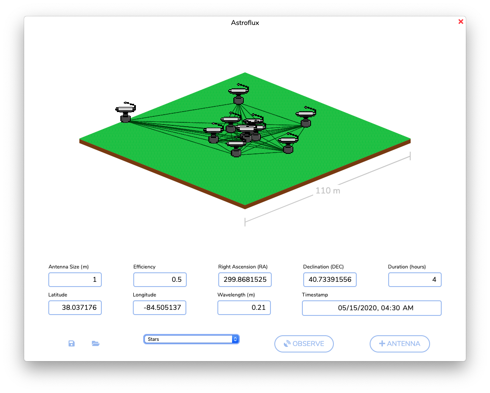
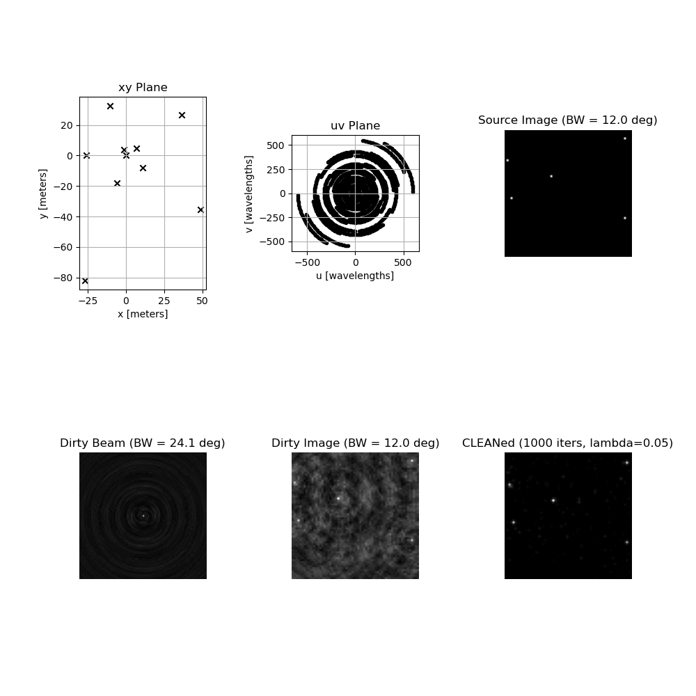

# Astroflux

An Electron + React frontend and Python backend for simulating radio telescope interferometry.


## Example Output


## Building & Running
Use `$ npm run build` to build and then `$ npm run start` to open the distribution app window.

## Installing the Stockert and Villa-Elisa Map
See NASA's [LAMBDA](https://lambda.gsfc.nasa.gov/product/foreground/fg_stockert_villa_get.cfm) page for the dataset details. To install the FITS map, use:

```bash
$ cd python
$ wget https://lambda.gsfc.nasa.gov/data/foregrounds/reich_reich/lambda_mollweide_STOCKERT+VILLA-ELISA_1420MHz_1_256.fits
```

See [A radio continuum survey of the northern sky at 1420 MHz. II", Reich, P. and Reich, W. 1986, A&AS, 63, 205](http://adsabs.harvard.edu/abs/1986A%26AS...63..205R).

## Command Line Tool
The Python command line simulation tool is separate from the front-end React + Electron UI. Running it outside the GUI will open a window with the output images and plots. Use `python astroflux.py -h` for information on using the command line tool.